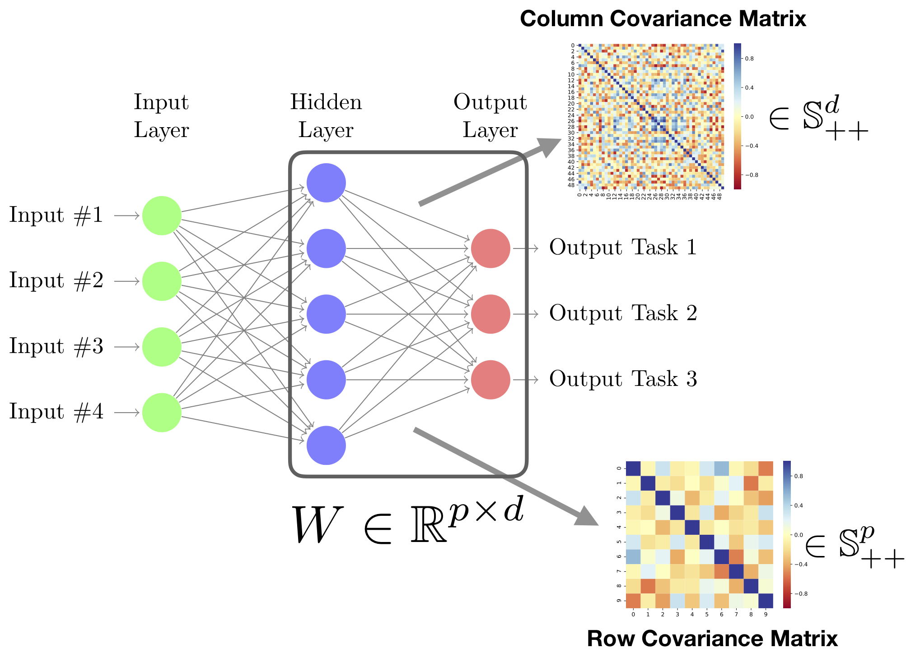
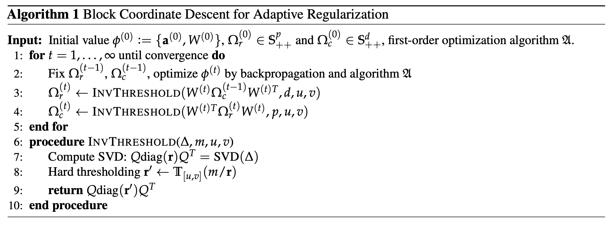

  

# Adaptive-Regularization-Neural-Network

> PyTorch demo code for paper "Learning Neural Networks with Adaptive Regularization"

## Paper
[**Learning Neural Networks with Adaptive Regularization**](https://arxiv.org/abs/1907.06288)<br>
[Han Zhao](http://www.cs.cmu.edu/~hzhao1/) *, [Yao-Hung Hubert Tsai](https://yaohungt.github.io) *, [Ruslan Salakhutdinov](https://www.cs.cmu.edu/~rsalakhu/), and [Geoffrey J. Gordon](http://www.cs.cmu.edu/~ggordon/) <br>
Thirty-third Conference on Neural Information Processing Systems (NeurIPS), 2019. (*equal contribution)

If you use this code for your research and find it helpful, please cite our paper:
```tex
@inproceedings{zhao2019adaptive,
  title={Learning Neural Networks with Adaptive Regularization},
  author={Zhao, Han and Tsai, Yao-Hung Hubert and Salakhutdinov, Ruslan and Gordon, Geoffrey J},
  booktitle={Advances in Neural Information Processing Systems},
  year={2019}
}
```

## Summary
In this paper we propose a method, **AdaReg**, to perform an adaptive and data-dependent regularization method when training neural networks with small-scale datasets. The follow figure shows a schematic illustration of **AdaReg** during training:



To summarize, for a fully connected layer (usually the last layer) $W\in\mathbb{R}^{d\times p}$, **AdaReg** maintains two additional covariance matrices:

*   Row covariance matrix $\Sigma_r\in\mathbb{S}_{++}^p$
*   Column covariance matrix $\Sigma_c\in\mathbb{S}_{++}^d$

During the training phase, **AdaReg** updates both $W, \Sigma_r$ and $\Sigma_c$ in a coordinate descent way. As usual, the update of $W$ could use any off-the-shelf optimizers provided by PyTorch. To update two covariance matrices, we derive closed form algorithm to achieve the optimal solution given any fixed $W$. Essentially, the algorithm contains two steps:

*   Compute a SVD of a matrix of size $d\times d$ or $p\times p$
*   Truncate all the singular values into the range $(u, v)$. That is, for all the singular values smaller than $u$, set them to be $u$. Similarly, for all the singular values greater than $v$, set them to be $v$.

The choice of hyperparameter $(u, v)$ should satisfy $0 < u < 1$ and $v > 1$. In practice and in our experiments we fix them to be $u = 1e-3$ and $v = 1e3$. Pseudo-code of the algorithm is shown in the following figure.



## How to use AdaReg in your model

Really simple! Here we give a minimum code snippet (in PyTorch) to illustrate the main idea. For the full implementation, please see function `BayesNet(args)` in `src/model.py` for more details.

First, for the weight matrix $W$, we need to define two covariance matrices:

```python
# Define two covariance matrices (in sqrt):
self.sqrt_covt = nn.Parameter(torch.eye(self.num_tasks), requires_grad=False)
self.sqrt_covf = nn.Parameter(torch.eye(self.num_feats), requires_grad=False)
```

Since we will use own analytic algorithm to optimize them, we set the `requires_grad` to be `False`. Next, implement a 4 line thresholding function:

```python
def _thresholding(self, sv, lower, upper):
    """
    Two-way thresholding of singular values.
    :param sv:  A list of singular values.
    :param lower:   Lower bound for soft-thresholding.
    :param upper:   Upper bound for soft-thresholding.
    :return:    Thresholded singular values.
    """
    uidx = sv > upper
    lidx = sv < lower
    sv[uidx] = upper
    sv[lidx] = lower
    return sv
```

The overall$ algorithm for updating both covariance matrices can then be implemented as:
```python
def update_covs(self, lower, upper):
    """
    Update both the covariance matrix over row and over column, using the closed form solutions.
    :param lower:   Lower bound of the truncation.
    :param upper:   Upper bound of the truncation.
    """
    covt = torch.mm(self.sqrt_covt, self.sqrt_covt.t())
    covf = torch.mm(self.sqrt_covf, self.sqrt_covf.t())
    ctask = torch.mm(torch.mm(self.W, covf), self.W.t())
    cfeat = torch.mm(torch.mm(self.W.t(), covt), self.W)
    # Compute SVD.
    ct, st, _ = torch.svd(ctask.data)
    cf, sf, _ = torch.svd(cfeat.data)
    st = self.num_feats / st
    sf = self.num_tasks / sf
    # Truncation of both singular values.
    st = self._thresholding(st, lower, upper)
    st = torch.sqrt(st)
    sf = self._thresholding(sf, lower, upper)
    sf = torch.sqrt(sf)
    # Recompute the value.
    self.sqrt_covt.data = torch.mm(torch.mm(ct, torch.diag(st)), ct.t())
    self.sqrt_covf.data = torch.mm(torch.mm(cf, torch.diag(sf)), cf.t())
```

Finally, we need to use the optimized covariance matrices to regularize the learning of our weight matrix $W$ (our goal!):

```python
def regularizer(self):
    """
    Compute the weight regularizer w.r.t. the weight matrix W.
    """
    r = torch.mm(torch.mm(self.sqrt_covt, self.W), self.sqrt_covf)
    return torch.sum(r * r)
```

Add this regularizer back to our favorite objective function (cross-entropy, mean-squared-error, etc) and backpropagate to update $W$, done!


## Have a try yourself on MNIST and CIFAR:

### Running CIFAR-10
```bash
python demo.py --dataset CIFAR10 
```

### Running MNIST
```bash
python demo.py --dataset MNIST
```

### Running MNIST with 1000 Training Samples and BatchSize 128
```bash
python demo.py --dataset MNIST --trainPartial --trainSize 1000 --batch_size 128
```

## Contact
Please email to [han.zhao@cs.cmu.edu](mailto:han.zhao@cs.cmu.edu) or [yaohungt@cs.cmu.edu ](mailto:yaohungt@cs.cmu.edu ) should you have any questions, comments or suggestions.
